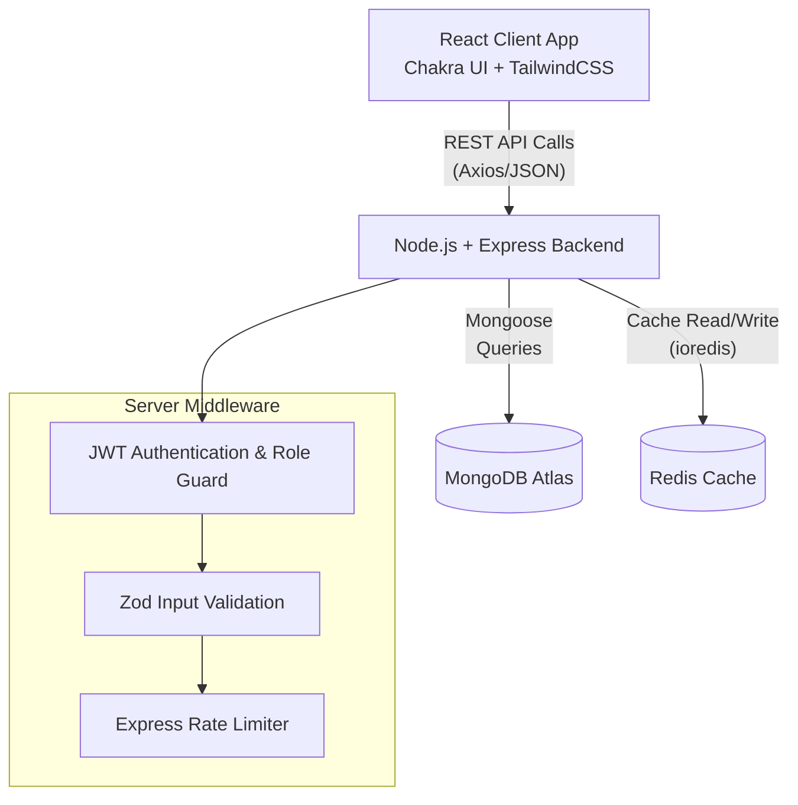
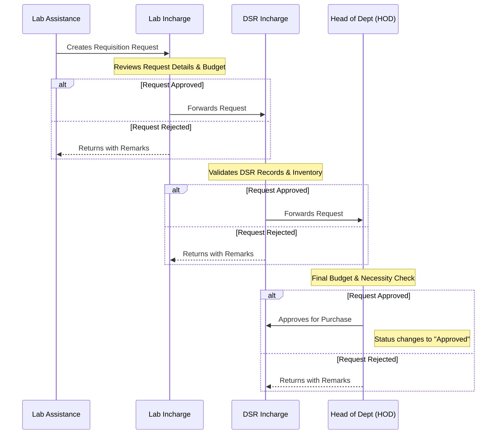
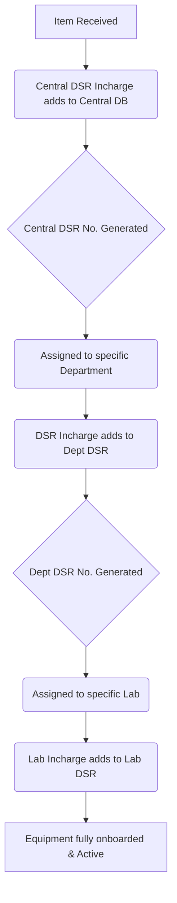
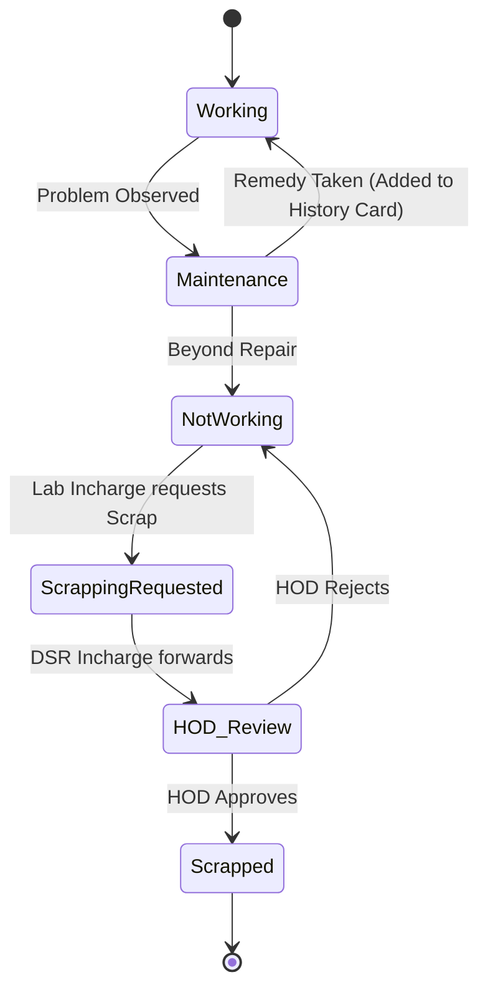
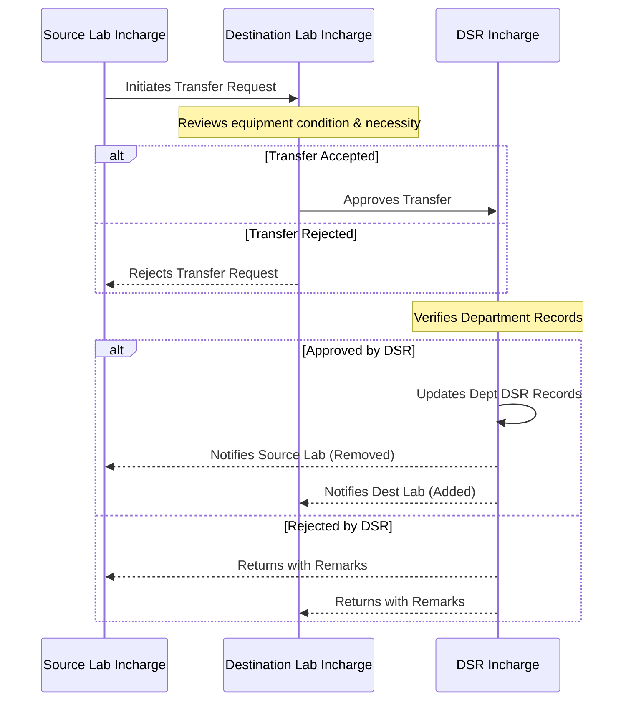

# Dead Stock Management System

A comprehensive web application designed to track, manage, and monitor the lifecycle of non-consumable equipment (Dead Stock) across various departments and laboratories in an educational or corporate institution.

## 📖 Project Overview

The **Dead Stock Management System** digitizes the traditionally manual process of tracking equipment. It handles everything from purchase requisitions and initial entries into the Dead Stock Register (DSR) to maintenance history tracking and final scrapping of non-functional items. 

The system implements a strict **hierarchical approval workflow**, ensuring that any purchase, transfer, or scrapping of equipment is vetted by the appropriate authorities (Lab Incharge, DSR Incharge, HOD, etc.).

---

## 🏗️ Architecture Diagram

The application follows a modern MERN-stack-like architecture, enhanced with Redis for caching and optimized performance.



### Tech Stack
*   **Frontend:** React 18, React Router v7, Chakra UI, TailwindCSS, Framer Motion (Animations).
*   **Backend:** Node.js, Express.js.
*   **Database:** MongoDB (via Mongoose).
*   **Caching:** Redis (via ioredis).
*   **Security:** JWT (JSON Web Tokens), bcrypt (Password hashing), CORS.

---

## 👥 Roles and Access Control

The system is strictly role-based. Users are assigned specific roles which dictate what they can view, add, or approve.

1.  **Lab Assistance:** Can create initial requisitions and view equipment within their assigned lab.
2.  **Lab Incharge:** Approves requests made by the Lab Assistance for their specific lab. Can add equipment history or request equipment scrapping.
3.  **DSR Incharge (Department level):** Maintains the Departmental Dead Stock Register. Approves requisitions forwarded by the Lab Incharge.
4.  **HOD (Head of Department):** The final authority at the department level. Approves all department-level purchases and scrapping requests. Allocates budget to different labs.
5.  **Central DSR Incharge:** Maintains the institute-level Central Dead Stock Register. 
6.  **Principal:** Supreme authority for approving high-budget requisitions and institute-wide reports.

---

## 🔄 Core Workflows

### 1. Purchase Requisition Workflow

When a lab needs new equipment, a requisition must go through a multi-tier approval process.



### 2. Equipment Onboarding Workflow (How items are added)

Once a purchase is approved and the physical item arrives, it needs to be added to the Dead Stock Registers.



### 3. Equipment Maintenance & Scrapping Workflow



### 4. Inter-Lab Equipment Transfer Workflow (Upcoming Feature)

*Note: This feature is currently in the development roadmap and is not yet implemented.*

When equipment needs to be moved from one lab to another within the same department, a transfer request is initiated to ensure proper tracking of assets.



---

## 🗄️ Database Architecture (Key Entities)

*   **Department:** Stores Department Code, Name, and Budget allocations (Equipment, Furniture, Consumables).
*   **Lab:** Associated with a Department, contains multiple Equipments.
*   **Equipment:** The core entity. Contains PO details, Invoice details, Central DSR No, Dept DSR No, Lab DSR No. 
*   **EachEquipment (Sub-Entity):** Because an `Equipment` entry might represent 10 identical computers, `EachEquipment` tracks the individual Serial No, specific Room No, and Status (Working/Not Working) of *each* computer.
*   **HistoryCardOFEquipment:** Tracks maintenance dates, problems observed, and remedies taken for individual equipments.
*   **Requisition:** Tracks the state (Pending, Approved, Rejected) of purchase requests as they move through the hierarchy.
*   **User:** Stores authentication details, Role, and assigned Department/Lab.

---

## 🚀 How to Run Locally

### Prerequisites
*   Node.js (v16+)
*   MongoDB Instance (Local or Atlas)
*   Redis Server (Running on default port 6379)

### 1. Server Setup
```bash
cd server
npm install
```
Create a `.env` file in the `server` directory:
```env
MONGO_URI=your_mongodb_connection_string
JWT_SECRET=your_jwt_secret
```
Start the server:
```bash
npm start
```

### 2. Client Setup
```bash
cd client
npm install
npm start
```
The React app will start on `http://localhost:3000`.

---

## 🧠 Architect's Considerations & Future Roadmap

*   **Data Integrity:** The hierarchical approval system ensures no single user can bypass financial protocols. The separation of `Equipment` (the batch purchase) and `EachEquipment` (the individual physical item) is a highly scalable approach to inventory management.
*   **Performance:** Redis caching is implemented on the backend. This is crucial for dashboard queries where HODs or Principals need aggregate data (total budgets, total equipments) without hammering the MongoDB instance.
*   **Security Roadblocks:** Transitioning from `localStorage` to `HttpOnly` cookies for JWT storage is highly recommended for production to mitigate XSS vulnerabilities.
*   **Audit Trails:** Every movement (approval, rejection, maintenance) should ideally be logged in an immutable `AuditLog` collection for compliance purposes.
